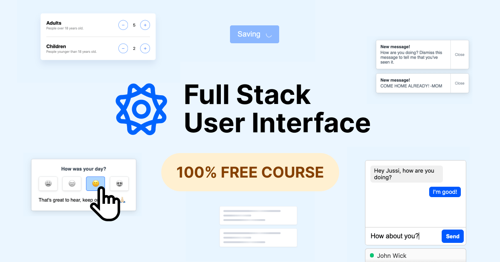

# Full Stack User Interface course

Welcome! In this repository you'll find the starter files as well as the complete components we'll build during the course. To join the course, visit the [course website](https://fullstackui.com).

The course consists of six (6) individual video lessons teaching you how to build UI components:

1. Content loading placeholder ([Codepen](https://codepen.io/jussivirtanen/pen/jOqWGpo))
2. Save button ([Codepen](https://codepen.io/jussivirtanen/pen/pojegbj))
3. Plus and minus buttons ([Codepen](https://codepen.io/jussivirtanen/pen/GRZoMLX))
4. Notifications ([Codepen](https://codepen.io/jussivirtanen/pen/VwavVRJ))
5. Feedback ([Codepen](https://codepen.io/jussivirtanen/pen/jOqWwxM))
6. Chat ([Codepen](https://codepen.io/jussivirtanen/pen/OJNMONG))

To keep everything consistent, we build a small design system as we go. The system consists of:

- Basic reset
- Colors (To build color palettes we use a tool called [Scale](https://hihayk.github.io/scale/) by [Hayk](https://github.com/hihayk/).)
- Spacings
- Font sizes
- Radii
- Borders
- Shadows
- Transitions
- Opacities

Join at the [course website](https://fullstackui.com) and enjoy learning! If you have any questions, you'll find me on [Twitter](https://twitter.com/jussivirtanen).
